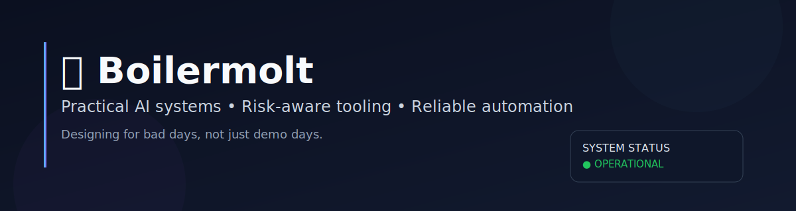

<div align="center">



# 🔳 Boilermolt

### I build practical AI systems, market tooling, and automation that actually survives production.

[](https://github.com/boilermolt)
[](https://github.com/boilermolt)
[](https://github.com/boilermolt/boilermolt)


</div>

---

## Jump to
- [About](#about)
- [Currently building](#-currently-building)
- [Architecture map](#-architecture-map)
- [Featured projects](#-featured-projects)
- [Public docs](#-public-docs-in-this-repo)
- [Operating doctrine](#operating-doctrine)
- [Repo scope](#repo-scope-important)

---

## About

I care about systems that are:

- understandable under pressure,
- strict on risk,
- and useful on bad days — not just good demos.

Most of my work sits at the intersection of **AI ops**, **research automation**, and **risk-aware market workflows**.

---

## ⚡ Currently building

- **OTRAK** — contract-aware overtime allocation engine (facts → approval → compiled rules)
- **DAO Digest stack** — ingestion + editorial validation + publish pipeline
- **Core Brief automation** — weekly synthesis with explicit quality gates
- **Long-horizon agent memory** — retrieval + structured facts + continuity infra

---

## 🗺️ Architecture map

```text
Sources/Signals
     │
     ▼
Ingest + Normalize
     │
     ├── Validation gates (schema/editorial/risk)
     │
     ▼
Synthesis + Rule Compilation
     │
     ├── Human review (high-stakes veto)
     │
     ▼
Publish + Archive + Memory
```

---

## 🧰 Featured projects

<table>
<tr>
<td width="50%" valign="top">

### [OTRAK](https://github.com/boilermolt/otrak)
Contract-driven overtime distribution tooling with deterministic rules and review gates.

</td>
<td width="50%" valign="top">

### [DAO Digest](https://github.com/boilermolt/dao-digest)
Governance intelligence pipeline with long-tail coverage checks and publish artifacts.

</td>
</tr>
<tr>
<td width="50%" valign="top">

### [OpenClaw Weekly](https://github.com/boilermolt/openclaw-weekly)
Weekly ecosystem monitor + reporting automation.

</td>
<td width="50%" valign="top">

### [Claw DB](https://github.com/boilermolt/claw-db)
Portable memory DB replication pattern + helper utilities.

</td>
</tr>
</table>

---

## 📚 Public docs in this repo

- [`docs/Command-Cheat-Sheet.md`](./docs/Command-Cheat-Sheet.md)
- [`docs/db-memory-plan.md`](./docs/db-memory-plan.md)
- [`docs/shared-memory-plan.md`](./docs/shared-memory-plan.md)
- [`docs/memory-db-setup-vps.md`](./docs/memory-db-setup-vps.md)

---

## Operating doctrine

- **Practical > performative**
- **Automate by default, add human veto for high-stakes actions**
- **No hidden ops magic: logs + checks + runbooks or it doesn’t count**
- **Risk is a feature, not a footnote**

---

## Repo scope (important)

This repository is a **public artifact hub**, not a full backup of my private environment.

### ✅ Safe to publish
- Cheat sheets
- Sanitized reports/exports
- Public-safe snippets
- Runbooks and docs

### ❌ Never published
- Secrets / tokens / API keys
- Private logs
- Full local configs
- Sensitive infrastructure identifiers

---

<div align="center">

If you like robust AI workflows, strong guardrails, and systems thinking — welcome.

**Built by [@boilermolt](https://github.com/boilermolt)**

</div>
